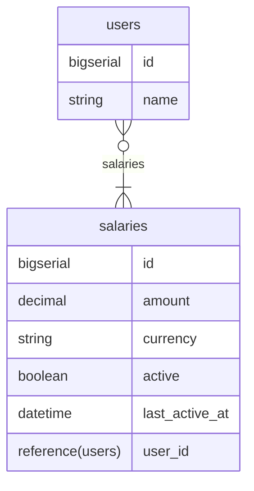

# Backend code exercise

Hi there!

If you're reading this, it means you're now at the coding exercise step of the engineering hiring process. We're really happy that you made it here and super appreciative of your time!

In this exercise you're asked to create a Phoenix application and implement some features on it.

> 💡 The Phoenix application is an API

Generally, we encourage candidates to make assumptions and solve this however they want, as long as those assumptions and approaches are explained and documented.
However, if you have any more questions, please don't hesitate to reach out directly to [code_exercise@remote.com](mailto:code_exercise@remote.com).

## Expectations

- It should be production-ready code - the code will show us how you ship things to production and be a mirror of your craft.
  - Just to be extra clear: We don't actually expect you to deploy it somewhere or build a release. It's meant as a statement regarding the quality of the solution.
- Take whatever time you need - we won’t look at start/end dates, you have a life besides this and we respect that! Moreover, if there is something you had to leave incomplete or there is a better solution you would implement but couldn’t due to personal time constraints, please try to walk us through your thought process or any missing parts, using the “Implementation Details” section below.

## What will you build

A phoenix app with 2 endpoints to manage users.

We don’t expect you to implement authentication and authorization but your final solution should assume it will be deployed to production and the data will be consumed by a Single Page Application that runs on customer’s browsers.

To save you some setup time we prepared this repo with a phoenix app that you can use to develop your solution. Alternatively, you can also generate a new phoenix project.

## Requirements

- We should store users and salaries in PostgreSQL database.
- Each user has a name and can have multiple salaries.
- Each salary should have a currency.
- Every field defined above should be required.
- One user should at most have 1 salary active at a given time.
- All endpoints should return JSON.
- A readme file with instructions on how to run the app.

### Seeding the database

- `mix ecto.setup` should create database tables, and seed the database with 20k users, for each user it should create 2 salaries with random amounts/currencies.
- The status of each salary should also be random, allowing for users without any active salary and for users with just 1 active salary.
- Must use 4 or more different currencies. Eg: USD, EUR, JPY and GBP.
- Users’ name can be random or populated from the result of calling list_names/0 defined in the following library: [https://github.com/remotecom/be_challengex](https://github.com/remotecom/be_challengex)
- Assume that engineers need to seed their databases regularly, so performance of the seed script matters.

### Tasks

1. 📄 Implement an endpoint to provide a list of users and their salaries
    - Each user should return their `name` and active `salary`.
    - Some users might have been offboarded (offboarding functionality should be considered out of the scope for this exercise) so it’s possible that all salaries that belong to a user are inactive. In those cases, the endpoint is supposed to return the salary that was active most recently.
    - This endpoint should support filtering by partial user name and order by user name.
    - Endpoint: `GET /users`

2. 📬 Implement an endpoint that sends an email to all users with active salaries
    - The action of sending the email must use Remote’s Challenge lib: [https://github.com/remotecom/be_challengex](https://github.com/remotecom/be_challengex)
    - ⚠️ This library doesn’t actually send any email so you don’t necessarily need internet access to work on your challenge.
    - Endpoint: `POST /invite-users`

### When you're done

- You can use the "Implementation Details" section to explain some decisions/shortcomings of your implementation.
- Open a Pull Request in this repo and send the link to [code_exercise@remote.com](mailto:code_exercise@remote.com).
- You can also send some feedback about this exercise. Was it too big/short? Boring? Let us know!

---

## How to run the existing application

You will need the following installed:

- Elixir >= 1.14
- Postgres >= 14.5

Check out the `.tool-versions` file for a concrete version combination we ran the application with. Using [asdf](https://github.com/asdf-vm/asdf) you could install their plugins and them via `asdf install`.

### To start your Phoenix server

- Run `mix setup` to install, setup dependencies and setup the database
- Start Phoenix endpoint with `mix phx.server` or inside IEx with `iex -S mix phx.server`

Now you can visit [`localhost:4000`](http://localhost:4000) from your browser.

---

## Implementation details

I've added pagination to the `/users` endpoint via `scrivener` library. This way, we can avoid returning a huge amount of data in a single request.

Also I didn't use any library for filtering and ordering. Instead of that, I've used Ecto's built-in functions to achieve the same result. In context of real applications I would moving forward with a library like `Flop` to handle complex pagination and filtering.

Regarding inviting users, I've decided to do asynchrounous processing via Oban jobs. This way, we can ensure that the request will return quickly and the email sending will be handled in the background.

I've also covered the code by tests, but only for API endpoints happy path and `Accounts` context. Missed to cover `InviteUsers` worker.

Also I've aded some unnecessary (for this test-task scope) things like changesets and validations.

Conslusions: it was a nice exercise to practice my Elixir/Phoenix/Ecto skills. I tried to avoid using too many libraries to show my ability to work with the language and its built-in tools. I've also tried to keep the code clean, well organized and documented. Of course, there are some improvements that could be done, but I think it's a good result in terms of the test task.


### Schema



### API

#### GET /users

**Parameters**

| Name       | Required | Type            |
|------------|----------|-----------------|
| name       | optional | string          |
| order_by[] | optional | array of string |

**Example**

```
curl --location --globoff 'http://localhost:4000/users?name=Tom&order_by[]=name.asc'
```

#### POST /invite-users

**No Parameters**

**Example**

```
curl --location --request POST 'http://localhost:4000/invite-users'
```
